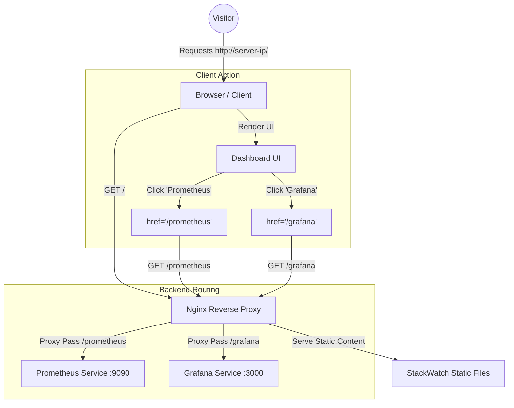

# StackWatch: Architectural & Operational Documentation

**Version:** 1.0.0  
**Classification:** Internal Technical Documentation  
**Architect:** Senior Cloud UI Architect

---

## 1. Architectural Overview

StackWatch is a **Static Frontend Gateway** designed to provide a unified entry point for the organization's observability stack. It adheres to the *Micro-Frontend* conceptual model, serving as a lightweight shell that delegates actual functionality to backend services (Prometheus, Grafana) via Nginx reverse proxying.

### Feature to Characteristic Mapping

| Feature | Architectural Characteristic | Justification |
| :--- | :--- | :--- |
| **Static HTML/JS Build** | **Scalability & Availability** | Can be served via Nginx/CDN with effectively infinite read throughput and zero backend logic processing time. |
| **Configurable `constants.ts`** | **Configurability & Extensibility** | Adding new tools (e.g., AlertManager) requires only a config entry change, not logic refactoring. |
| **Relative Path Routing** | **Portability** | The app uses relative paths (`/prometheus`), allowing it to be deployed on any server IP or domain without code recompilation. |
| **Tailwind CSS System** | **Maintainability** | Utility-first CSS ensures consistent styling tokens and reduces the risk of "CSS bloat" over time. |
| **Accessible HTML Semantic** | **Usability** | Compliant with WCAG 2.1 AA via semantic tags (`main`, `nav`, `aria-label`) and high contrast ratios. |

### Technology Stack Decision

1.  **React 18 + TypeScript:** Provides type safety and component modularity. While "static HTML" is the output, the *development experience* requires strict typing to prevent broken links or UI regressions.
2.  **Tailwind CSS:** Eliminates context switching between CSS files and HTML. Ensures the design system is immutable and consistent across the dashboard.
3.  **Vite (Implied Build Tool):** Chosen for fast HMR (Hot Module Replacement) and optimized production bundling (tree-shaking unused code).

---

## 2. UI Wireframe & Flow

### Wireframe (ASCII)

```text
+---------------------------------------------------------------+
|  [Header]  StackWatch | Infrastructure Gateway      [Status]   |
+---------------------------------------------------------------+
|                                                               |
|          [ Title: Observability Stack Selection ]             |
|                                                               |
|    +----------------------+      +----------------------+     |
|    |                      |      |                      |     |
|    |  [Icon: Flame]       |      |  [Icon: Dashboard]   |     |
|    |                      |      |                      |     |
|    |  PROMETHEUS          |      |  GRAFANA             |     |
|    |                      |      |                      |     |
|    |  Metric Collection   |      |  Data Visualization  |     |
|    |                      |      |                      |     |
|    |  [Status Indicator]  |      |  [Status Indicator]  |     |
|    |                      |      |                      |     |
|    +----------------------+      +----------------------+     |
|                                                               |
|    [Info Box: Traffic routed via Secure Gateway / nginx]      |
|                                                               |
+---------------------------------------------------------------+
|  [Footer] v1.0.0 | Env: Production | © 2024 StackWatch         |
+---------------------------------------------------------------+
```

### Frontend Flow Diagram (Mermaid)



---

## 3. API Interaction Contract

Although StackWatch is a static frontend, it relies on an implicit "Infrastructure Contract".

**1. Data Assumptions:**
*   The frontend assumes that the backend services are alive. It does not actively poll health endpoints (to keep the artifact static and simple).
*   Visual status indicators (green dots) in the UI represent *configured* status, not *live* status, unless a future `fetch` mechanism is implemented.

**2. Routing Contract:**
*   **Prometheus**: MUST be accessible at `<HOST>/prometheus`. Nginx must strip the prefix if Prometheus is not configured with `web.external-url`.
*   **Grafana**: MUST be accessible at `<HOST>/grafana`. Nginx config `root_url` in `grafana.ini` must match.

---

## 4. Operational Document

### Nginx Deployment Configuration

To deploy StackWatch, use the following Nginx block. This handles the static file serving AND the reverse proxying required by the architecture.

```nginx
server {
    listen 80;
    server_name _;
    root /var/www/stackwatch/dist; # Location of the React build output
    index index.html;

    # 1. Serve StackWatch Frontend
    location / {
        try_files $uri $uri/ /index.html;
    }

    # 2. Route to Prometheus
    location /prometheus/ {
        proxy_pass http://localhost:9090/;
        proxy_set_header Host $host;
    }

    # 3. Route to Grafana
    location /grafana/ {
        proxy_pass http://localhost:3000/;
        proxy_set_header Host $host;
    }
}
```

### Validation Checklist

1.  **Build Integrity**: Run `npm run build`. Verify `dist/index.html` exists.
2.  **Asset Loading**: Open `index.html` locally. Verify Tailwind CSS styles apply.
3.  **Navigation Check**: Hover over buttons. Verify URL bar shows `/prometheus` and `/grafana` (not full absolute URLs).
4.  **Accessibility**: Tab through the interface. Verify focus rings appear on cards.

### Known Failure Scenarios

*   **Scenario:** 404 on Service Click.
    *   *Cause:* Nginx `proxy_pass` misconfiguration or trailing slash issue.
    *   *Fix:* Ensure `location /prometheus/` matches the `proxy_pass` trailing slash policy.
*   **Scenario:** White screen on load.
    *   *Cause:* JavaScript disabled or React failed to mount.
    *   *Guard:* The `index.html` contains a basic background color to prevent flash-of-unstyled-content, but app requires JS.

---
**Document End**
