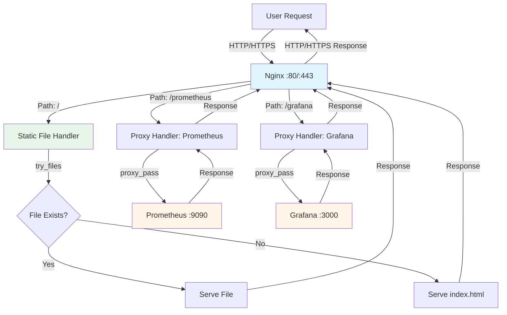
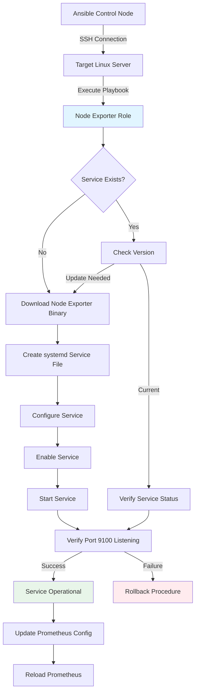
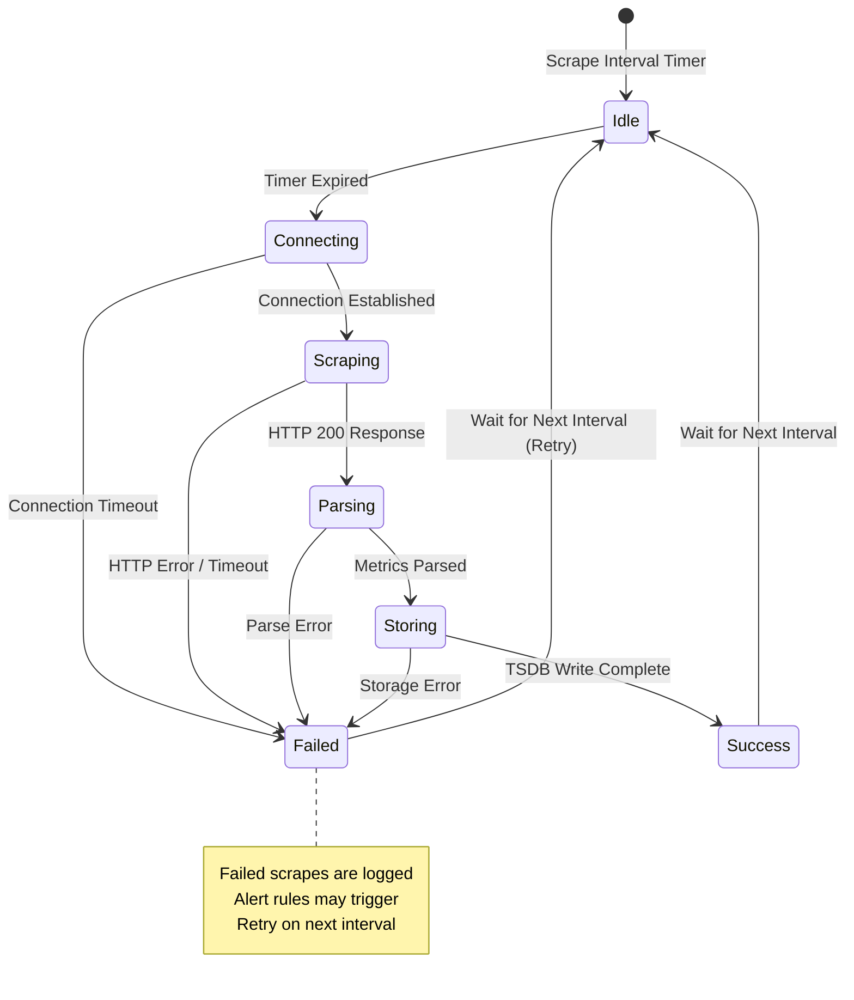
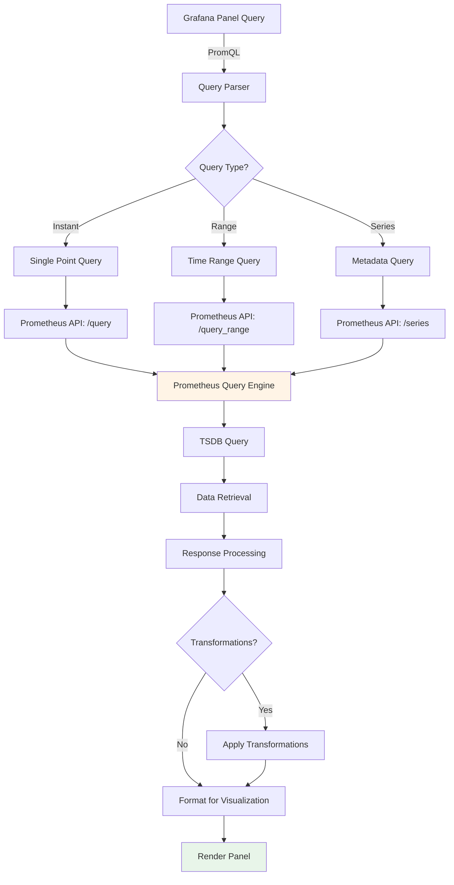

# STACKWATCH: Workflow Diagrams and Data Flow Documentation

**Document Version:** 1.0.0  
**Classification:** Internal Technical Documentation  
**Last Updated:** 2024  
**Architect:** Senior Cloud Infrastructure Architect and Automation Engineer

---

## 1. Nginx Routing Workflow

### 1.1 Request Routing Decision Tree

```
┌─────────────────────────────────────────────────────────────┐
│                    User Request Arrives                      │
│              GET http://server-ip/<path>                     │
└───────────────────────────┬─────────────────────────────────┘
                            │
                            ▼
┌─────────────────────────────────────────────────────────────┐
│                    Nginx Receives Request                    │
│              Port: 80 (HTTP) or 443 (HTTPS)                  │
└───────────────────────────┬─────────────────────────────────┘
                            │
                            ▼
                    ┌───────┴───────┐
                    │  Path Match?   │
                    └───────┬───────┘
                            │
        ┌───────────────────┼───────────────────┐
        │                   │                   │
        ▼                   ▼                   ▼
┌──────────────┐   ┌──────────────┐   ┌──────────────┐
│ Path: /      │   │ Path: /prom  │   │ Path: /graf  │
│              │   │ etheus*      │   │ ana*         │
└──────┬───────┘   └──────┬───────┘   └──────┬───────┘
       │                  │                   │
       ▼                  ▼                   ▼
┌──────────────┐   ┌──────────────┐   ┌──────────────┐
│ Serve Static │   │ Proxy Pass    │   │ Proxy Pass   │
│ Files        │   │ to Prometheus │   │ to Grafana   │
│              │   │               │   │              │
│ Location:    │   │ Location:     │   │ Location:    │
│ /var/www/    │   │ /prometheus/  │   │ /grafana/    │
│ stackwatch/   │   │               │   │              │
│ dist/        │   │ Proxy:        │   │ Proxy:       │
│              │   │ http://       │   │ http://      │
│ try_files:   │   │ localhost:    │   │ localhost:   │
│ $uri $uri/   │   │ 9090/         │   │ 3000/        │
│ /index.html  │   │               │   │              │
└──────────────┘   └───────┬───────┘   └───────┬───────┘
                           │                   │
                           └─────────┬─────────┘
                                     │
                                     ▼
                           ┌──────────────────┐
                           │  Backend Service │
                           │  Processes       │
                           │  Request         │
                           └──────────────────┘
```

### 1.2 Nginx Configuration Flow (Mermaid)



### 1.3 Nginx Location Block Processing

**Processing Order:**
1. **Exact Match (`=`)**: Highest priority
2. **Prefix Match (`^~`)**: Stops regex evaluation
3. **Regex Match (`~`, `~*`)**: Case-sensitive, case-insensitive
4. **Longest Prefix Match**: Default behavior

**StackWatch Routing Logic:**
```
Location: /prometheus/
  ├─ Priority: Prefix Match
  ├─ Action: proxy_pass http://localhost:9090/
  ├─ Header: proxy_set_header Host $host
  └─ Result: /prometheus/metrics → http://localhost:9090/metrics

Location: /grafana/
  ├─ Priority: Prefix Match
  ├─ Action: proxy_pass http://localhost:3000/
  ├─ Header: proxy_set_header Host $host
  └─ Result: /grafana/dashboards → http://localhost:3000/dashboards

Location: /
  ├─ Priority: Default Prefix Match
  ├─ Action: try_files $uri $uri/ /index.html
  ├─ Root: /var/www/stackwatch/dist
  └─ Result: SPA routing support
```

---

## 2. Exporter Pipeline Workflow

### 2.1 Node Exporter (Linux) Pipeline

```
┌─────────────────────────────────────────────────────────────┐
│              Linux System (Target Server)                    │
└───────────────────────────┬─────────────────────────────────┘
                            │
                            ▼
┌─────────────────────────────────────────────────────────────┐
│         Node Exporter Service (systemd)                      │
│         Port: 9100                                           │
│         Status: Running                                      │
└───────────────────────────┬─────────────────────────────────┘
                            │
                            ▼
┌─────────────────────────────────────────────────────────────┐
│         Metrics Collection Engine                            │
│                                                              │
│  ┌──────────────┐  ┌──────────────┐  ┌──────────────┐     │
│  │ CPU Metrics  │  │ Memory       │  │ Disk I/O     │     │
│  │ - user       │  │ Metrics      │  │ Metrics      │     │
│  │ - system     │  │ - used       │  │ - read       │     │
│  │ - idle       │  │ - free       │  │ - write      │     │
│  │ - iowait     │  │ - cached     │  │ - iops       │     │
│  └──────────────┘  └──────────────┘  └──────────────┘     │
│                                                              │
│  ┌──────────────┐  ┌──────────────┐  ┌──────────────┐     │
│  │ Network      │  │ File System  │  │ System Info  │     │
│  │ Metrics      │  │ Metrics      │  │ - uptime     │     │
│  │ - bytes_in   │  │ - size       │  │ - load       │     │
│  │ - bytes_out  │  │ - used       │  │ - processes  │     │
│  │ - packets    │  │ - available   │  │              │     │
│  └──────────────┘  └──────────────┘  └──────────────┘     │
└───────────────────────────┬─────────────────────────────────┘
                            │
                            ▼
┌─────────────────────────────────────────────────────────────┐
│         HTTP Metrics Endpoint                                │
│         GET http://target-server:9100/metrics                │
│                                                              │
│         Response Format: Prometheus Exposition Format        │
│         # TYPE node_cpu_seconds_total counter                │
│         node_cpu_seconds_total{cpu="0",mode="idle"} 12345.67 │
└───────────────────────────┬─────────────────────────────────┘
                            │
                            ▼
┌─────────────────────────────────────────────────────────────┐
│         Prometheus Scraper (Pull Model)                      │
│         Scrape Interval: 15s (default)                       │
│         Scrape Timeout: 10s (default)                        │
└───────────────────────────┬─────────────────────────────────┘
                            │
                            ▼
┌─────────────────────────────────────────────────────────────┐
│         Prometheus TSDB Storage                               │
│         Time-Series Database                                 │
└─────────────────────────────────────────────────────────────┘
```

### 2.2 Windows Exporter Pipeline

```
┌─────────────────────────────────────────────────────────────┐
│              Windows System (Target Server)                  │
└───────────────────────────┬─────────────────────────────────┘
                            │
                            ▼
┌─────────────────────────────────────────────────────────────┐
│         Windows Exporter Service                             │
│         Port: 9182                                           │
│         Status: Running                                      │
└───────────────────────────┬─────────────────────────────────┘
                            │
                            ▼
┌─────────────────────────────────────────────────────────────┐
│         Windows Metrics Collection                           │
│                                                              │
│  ┌──────────────┐  ┌──────────────┐  ┌──────────────┐     │
│  │ CPU Metrics  │  │ Memory       │  │ Disk I/O     │     │
│  │ - Percent    │  │ Metrics      │  │ Metrics      │     │
│  │   Processor  │  │ - Available  │  │ - Read       │     │
│  │   Time       │  │ - Used       │  │ - Write      │     │
│  │ - Interrupts │  │ - Committed  │  │ - Queue      │     │
│  └──────────────┘  └──────────────┘  └──────────────┘     │
│                                                              │
│  ┌──────────────┐  ┌──────────────┐  ┌──────────────┐     │
│  │ Network      │  │ Windows      │  │ Services     │     │
│  │ Metrics      │  │ Services     │  │ Status       │     │
│  │ - Bytes      │  │ - IIS        │  │ - Running    │     │
│  │ - Packets    │  │ - SQL Server │  │ - Stopped    │     │
│  │ - Errors     │  │ - Exchange   │  │ - Paused     │     │
│  └──────────────┘  └──────────────┘  └──────────────┘     │
└───────────────────────────┬─────────────────────────────────┘
                            │
                            ▼
┌─────────────────────────────────────────────────────────────┐
│         HTTP Metrics Endpoint                                │
│         GET http://windows-server:9182/metrics              │
│                                                              │
│         Response Format: Prometheus Exposition Format        │
│         # TYPE windows_cpu_time_total counter                │
│         windows_cpu_time_total{core="0"} 12345.67            │
└───────────────────────────┬─────────────────────────────────┘
                            │
                            ▼
┌─────────────────────────────────────────────────────────────┐
│         Prometheus Scraper (Pull Model)                      │
│         Scrape Interval: 15s (default)                       │
│         Scrape Timeout: 10s (default)                        │
└───────────────────────────┬─────────────────────────────────┘
                            │
                            ▼
┌─────────────────────────────────────────────────────────────┐
│         Prometheus TSDB Storage                               │
│         Time-Series Database                                 │
└─────────────────────────────────────────────────────────────┘
```

### 2.3 Exporter Deployment Workflow (Ansible)



---

## 3. Prometheus Scraping Workflow

### 3.1 Scraping Configuration Flow

```
┌─────────────────────────────────────────────────────────────┐
│         Prometheus Configuration (prometheus.yml)            │
│                                                              │
│  scrape_configs:                                             │
│    - job_name: 'node-exporter'                               │
│      static_configs:                                         │
│        - targets: ['server1:9100', 'server2:9100']           │
│    - job_name: 'windows-exporter'                            │
│      static_configs:                                         │
│        - targets: ['win-server1:9182', 'win-server2:9182']   │
└───────────────────────────┬─────────────────────────────────┘
                            │
                            ▼
┌─────────────────────────────────────────────────────────────┐
│         Prometheus Scrape Manager                           │
│         Initializes scrape targets from config               │
└───────────────────────────┬─────────────────────────────────┘
                            │
                            ▼
┌─────────────────────────────────────────────────────────────┐
│         Scrape Scheduler                                     │
│         Interval: 15s (configurable per job)                 │
│         Timeout: 10s (configurable per job)                  │
└───────────────────────────┬─────────────────────────────────┘
                            │
                            ▼
                    ┌───────┴───────┐
                    │  Scrape Loop  │
                    └───────┬───────┘
                            │
        ┌───────────────────┼───────────────────┐
        │                   │                   │
        ▼                   ▼                   ▼
┌──────────────┐   ┌──────────────┐   ┌──────────────┐
│ Target 1     │   │ Target 2     │   │ Target N     │
│ :9100        │   │ :9100        │   │ :9182        │
└──────┬───────┘   └──────┬───────┘   └──────┬───────┘
       │                  │                   │
       ▼                  ▼                   ▼
┌──────────────┐   ┌──────────────┐   ┌──────────────┐
│ HTTP GET     │   │ HTTP GET     │   │ HTTP GET     │
│ /metrics     │   │ /metrics     │   │ /metrics     │
└──────┬───────┘   └──────┬───────┘   └──────┬───────┘
       │                  │                   │
       ▼                  ▼                   ▼
┌──────────────┐   ┌──────────────┐   ┌──────────────┐
│ Parse        │   │ Parse        │   │ Parse        │
│ Metrics      │   │ Metrics      │   │ Metrics      │
│ Format       │   │ Format       │   │ Format       │
└──────┬───────┘   └──────┬───────┘   └──────┬───────┘
       │                  │                   │
       └──────────────────┼───────────────────┘
                          │
                          ▼
┌─────────────────────────────────────────────────────────────┐
│         Label Enrichment                                    │
│         Add job, instance labels                             │
└───────────────────────────┬─────────────────────────────────┘
                            │
                            ▼
┌─────────────────────────────────────────────────────────────┐
│         TSDB Write                                          │
│         Store time-series data                              │
└─────────────────────────────────────────────────────────────┘
```

### 3.2 Prometheus Scraping State Machine



### 3.3 Service Discovery Workflow (Future Enhancement)

```
┌─────────────────────────────────────────────────────────────┐
│         Service Discovery Configuration                      │
│         (Not Currently Implemented)                          │
└───────────────────────────┬─────────────────────────────────┘
                            │
                            ▼
┌─────────────────────────────────────────────────────────────┐
│         Discovery Mechanism Options:                         │
│                                                              │
│  1. Static Config (Current)                                  │
│     - Manual target list                                     │
│     - Fixed IP addresses                                     │
│                                                              │
│  2. File-based SD (Recommended)                             │
│     - JSON/YAML file watched by Prometheus                   │
│     - Updated by external tool (Ansible, etc.)               │
│                                                              │
│  3. DNS-based SD (Future)                                    │
│     - SRV record discovery                                   │
│     - Automatic target resolution                            │
│                                                              │
│  4. Consul/etcd SD (Future)                                  │
│     - Service registry integration                           │
│     - Dynamic target management                              │
└───────────────────────────┬─────────────────────────────────┘
                            │
                            ▼
┌─────────────────────────────────────────────────────────────┐
│         Target Refresh                                       │
│         Periodic re-evaluation of targets                    │
└───────────────────────────┬─────────────────────────────────┘
                            │
                            ▼
┌─────────────────────────────────────────────────────────────┐
│         Active Targets List                                  │
│         Updated target inventory                             │
└─────────────────────────────────────────────────────────────┘
```

---

## 4. Grafana Query Model Workflow

### 4.1 Grafana Dashboard Query Flow

```
┌─────────────────────────────────────────────────────────────┐
│         User Opens Grafana Dashboard                         │
│         URL: /grafana/d/<dashboard-id>                       │
└───────────────────────────┬─────────────────────────────────┘
                            │
                            ▼
┌─────────────────────────────────────────────────────────────┐
│         Grafana Dashboard Engine                             │
│         Loads dashboard JSON definition                      │
└───────────────────────────┬─────────────────────────────────┘
                            │
                            ▼
┌─────────────────────────────────────────────────────────────┐
│         Panel Query Configuration                            │
│                                                              │
│  Panel 1: CPU Usage                                         │
│    Query: 100 - (avg(irate(node_cpu_seconds_total           │
│            {mode="idle"}[5m])) * 100)                       │
│    Data Source: Prometheus                                  │
│                                                              │
│  Panel 2: Memory Usage                                      │
│    Query: node_memory_MemTotal_bytes -                      │
│            node_memory_MemFree_bytes                        │
│    Data Source: Prometheus                                  │
└───────────────────────────┬─────────────────────────────────┘
                            │
                            ▼
┌─────────────────────────────────────────────────────────────┐
│         Grafana Query Engine                                 │
│         Processes PromQL queries                             │
└───────────────────────────┬─────────────────────────────────┘
                            │
                            ▼
┌─────────────────────────────────────────────────────────────┐
│         Prometheus Data Source                               │
│         HTTP API Connection                                  │
│         Base URL: http://localhost:9090                     │
└───────────────────────────┬─────────────────────────────────┘
                            │
                            ▼
┌─────────────────────────────────────────────────────────────┐
│         Prometheus Query API                                │
│         POST /api/v1/query                                  │
│         POST /api/v1/query_range                            │
│         POST /api/v1/series                                 │
└───────────────────────────┬─────────────────────────────────┘
                            │
                            ▼
┌─────────────────────────────────────────────────────────────┐
│         Prometheus Query Engine                              │
│         Executes PromQL against TSDB                        │
└───────────────────────────┬─────────────────────────────────┘
                            │
                            ▼
┌─────────────────────────────────────────────────────────────┐
│         TSDB Query Execution                                 │
│         Retrieves time-series data                          │
└───────────────────────────┬─────────────────────────────────┘
                            │
                            ▼
┌─────────────────────────────────────────────────────────────┐
│         Query Response (JSON)                                │
│         {                                                    │
│           "status": "success",                              │
│           "data": {                                          │
│             "resultType": "vector",                         │
│             "result": [...]                                 │
│           }                                                  │
│         }                                                    │
└───────────────────────────┬─────────────────────────────────┘
                            │
                            ▼
┌─────────────────────────────────────────────────────────────┐
│         Grafana Data Processing                              │
│         Transforms Prometheus response                      │
│         Applies transformations (rate, sum, etc.)           │
└───────────────────────────┬─────────────────────────────────┘
                            │
                            ▼
┌─────────────────────────────────────────────────────────────┐
│         Visualization Rendering                              │
│         Graph, Table, Stat, Gauge, etc.                     │
└───────────────────────────┬─────────────────────────────────┘
                            │
                            ▼
┌─────────────────────────────────────────────────────────────┐
│         Dashboard Display                                    │
│         Rendered HTML/Canvas                                 │
└─────────────────────────────────────────────────────────────┘
```

### 4.2 Grafana Query Types and Execution

**Query Types:**

1. **Instant Query** (`/api/v1/query`)
   - Single point in time
   - Used for: Current values, single stat panels
   - Example: `node_cpu_seconds_total{mode="idle"}`

2. **Range Query** (`/api/v1/query_range`)
   - Time series over range
   - Used for: Graphs, time series panels
   - Example: `rate(node_cpu_seconds_total[5m])` over last 1 hour

3. **Series Query** (`/api/v1/series`)
   - Metadata discovery
   - Used for: Label value autocomplete, series discovery
   - Example: Find all series matching `{job="node-exporter"}`

### 4.3 Grafana Query Optimization Flow



---

## 5. End-to-End Request Flow

### 5.1 Complete User Journey: Viewing Metrics

```
┌─────────────────────────────────────────────────────────────┐
│  STEP 1: User Accesses StackWatch Gateway                     │
│  GET http://server-ip/                                        │
└───────────────────────────┬─────────────────────────────────┘
                            │
                            ▼
┌─────────────────────────────────────────────────────────────┐
│  Nginx: Serves Static Frontend                               │
│  File: /var/www/stackwatch/dist/index.html                   │
└───────────────────────────┬─────────────────────────────────┘
                            │
                            ▼
┌─────────────────────────────────────────────────────────────┐
│  Browser: Renders StackWatch UI                              │
│  Displays: Prometheus and Grafana service cards              │
└───────────────────────────┬─────────────────────────────────┘
                            │
                            ▼
┌─────────────────────────────────────────────────────────────┐
│  STEP 2: User Clicks "Grafana" Card                          │
│  Navigation: href="/grafana"                                 │
└───────────────────────────┬─────────────────────────────────┘
                            │
                            ▼
┌─────────────────────────────────────────────────────────────┐
│  Nginx: Proxy Pass to Grafana                                │
│  Location: /grafana/ → http://localhost:3000/               │
└───────────────────────────┬─────────────────────────────────┘
                            │
                            ▼
┌─────────────────────────────────────────────────────────────┐
│  Grafana: Serves Dashboard Interface                         │
│  Port: 3000                                                  │
└───────────────────────────┬─────────────────────────────────┘
                            │
                            ▼
┌─────────────────────────────────────────────────────────────┐
│  STEP 3: Dashboard Loads and Executes Queries               │
│  Panel: CPU Usage Graph                                      │
└───────────────────────────┬─────────────────────────────────┘
                            │
                            ▼
┌─────────────────────────────────────────────────────────────┐
│  Grafana: Sends PromQL Query to Prometheus                   │
│  POST http://localhost:9090/api/v1/query_range              │
│  Query: rate(node_cpu_seconds_total[5m])                    │
└───────────────────────────┬─────────────────────────────────┘
                            │
                            ▼
┌─────────────────────────────────────────────────────────────┐
│  Prometheus: Executes Query Against TSDB                     │
│  Retrieves: Historical time-series data                     │
└───────────────────────────┬─────────────────────────────────┘
                            │
                            ▼
┌─────────────────────────────────────────────────────────────┐
│  Prometheus: Returns JSON Response                          │
│  { "status": "success", "data": {...} }                     │
└───────────────────────────┬─────────────────────────────────┘
                            │
                            ▼
┌─────────────────────────────────────────────────────────────┐
│  Grafana: Processes Response and Renders Graph              │
│  Visualization: Time series line chart                       │
└───────────────────────────┬─────────────────────────────────┘
                            │
                            ▼
┌─────────────────────────────────────────────────────────────┐
│  Browser: Displays Final Dashboard                          │
│  User sees: CPU usage graph with historical data            │
└─────────────────────────────────────────────────────────────┘
```

### 5.2 Metrics Collection End-to-End Flow

```
┌─────────────────────────────────────────────────────────────┐
│  Background Process: Continuous Metrics Collection           │
└───────────────────────────┬─────────────────────────────────┘
                            │
                            ▼
┌─────────────────────────────────────────────────────────────┐
│  Node Exporter: Collects System Metrics                     │
│  Server: linux-server-01                                     │
│  Port: 9100                                                  │
│  Metrics: CPU, Memory, Disk, Network                         │
└───────────────────────────┬─────────────────────────────────┘
                            │
                            ▼
┌─────────────────────────────────────────────────────────────┐
│  Prometheus: Scrapes Node Exporter                           │
│  Interval: Every 15 seconds                                  │
│  GET http://linux-server-01:9100/metrics                    │
└───────────────────────────┬─────────────────────────────────┘
                            │
                            ▼
┌─────────────────────────────────────────────────────────────┐
│  Prometheus: Parses and Stores Metrics                       │
│  TSDB: Time-series database                                  │
│  Labels: {job="node-exporter", instance="linux-server-01"}  │
└───────────────────────────┬─────────────────────────────────┘
                            │
                            ▼
┌─────────────────────────────────────────────────────────────┐
│  Grafana: Queries Prometheus for Visualization              │
│  Query: node_cpu_seconds_total{mode="idle"}                 │
│  Time Range: Last 1 hour                                     │
└───────────────────────────┬─────────────────────────────────┘
                            │
                            ▼
┌─────────────────────────────────────────────────────────────┐
│  User: Views Metrics in Dashboard                            │
│  Dashboard: System Overview                                 │
│  Panel: CPU Usage Over Time                                 │
└─────────────────────────────────────────────────────────────┘
```

---

## 6. Error Handling and Failure Modes

### 6.1 Nginx Error Handling

```
Request Processing
    │
    ▼
┌──────────────┐
│ Nginx Error? │
└──────┬───────┘
       │
   ┌───┴───┐
   │       │
   ▼       ▼
┌─────┐ ┌──────────┐
│ 404 │ │ 502/503 │
└─────┘ └────┬─────┘
            │
            ▼
    ┌───────────────┐
    │ Backend Down? │
    └───────┬───────┘
            │
        ┌───┴───┐
        │       │
        ▼       ▼
    ┌──────┐ ┌──────────┐
    │ Retry│ │ Error    │
    │      │ │ Page     │
    └──────┘ └──────────┘
```

### 6.2 Prometheus Scraping Failure Handling

**Failure Scenarios:**
1. **Target Unreachable**: Connection timeout, network error
2. **HTTP Error**: 404, 500, etc.
3. **Parse Error**: Invalid metrics format
4. **Storage Error**: TSDB write failure

**Recovery Actions:**
- Log error with target identification
- Continue scraping other targets
- Retry on next scrape interval
- Alert if consecutive failures exceed threshold

---

## Document Control

**Version History:**
- 1.0.0 (2024): Initial workflow diagrams document

**Review Cycle:** Quarterly  
**Next Review Date:** TBD  
**Approval Required:** Infrastructure Team Lead

---

**END OF WORKFLOW DIAGRAMS DOCUMENT**

